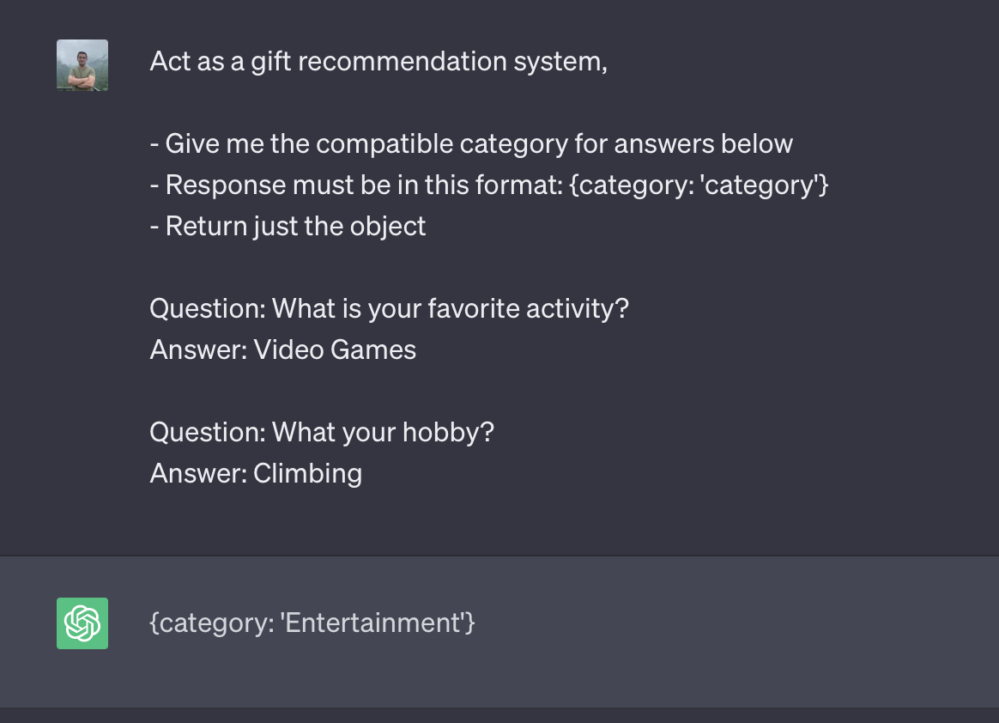
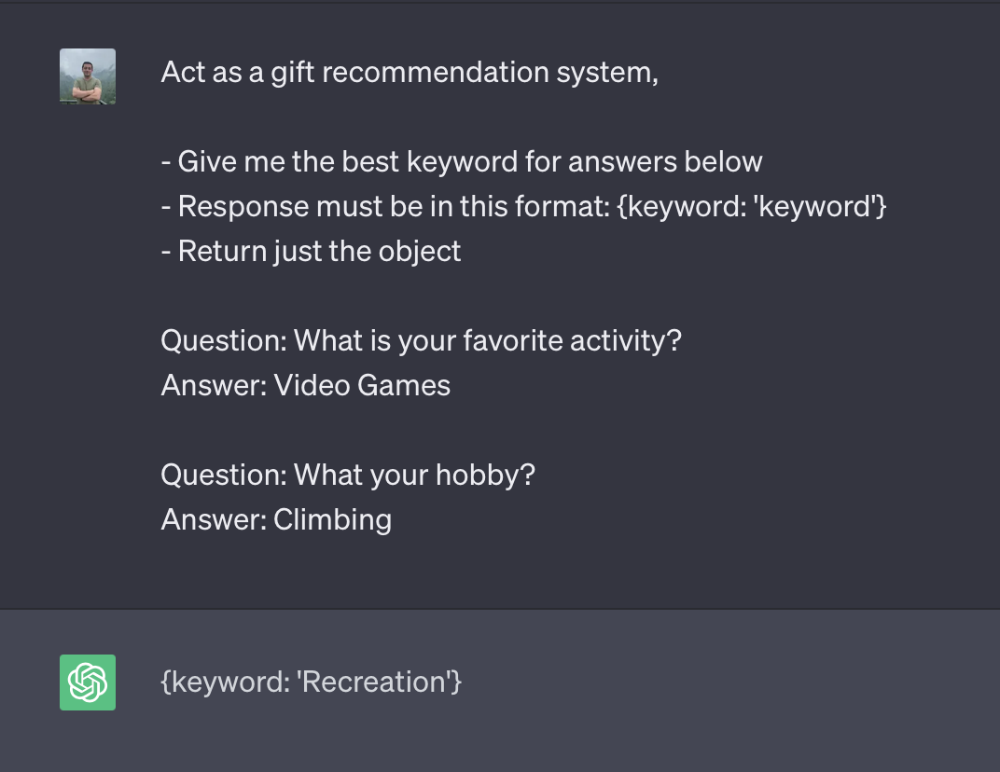
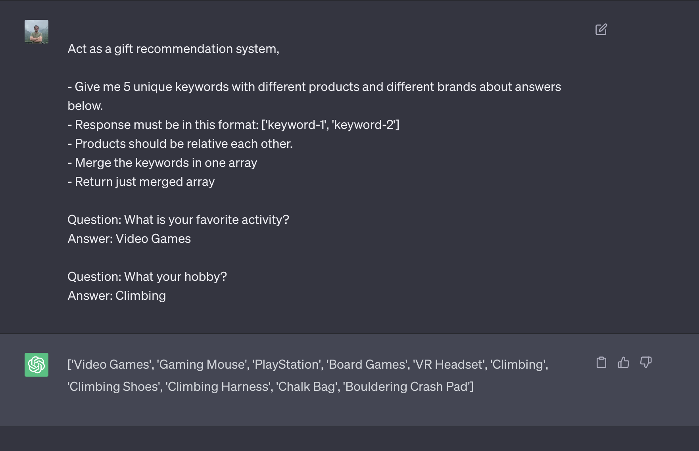
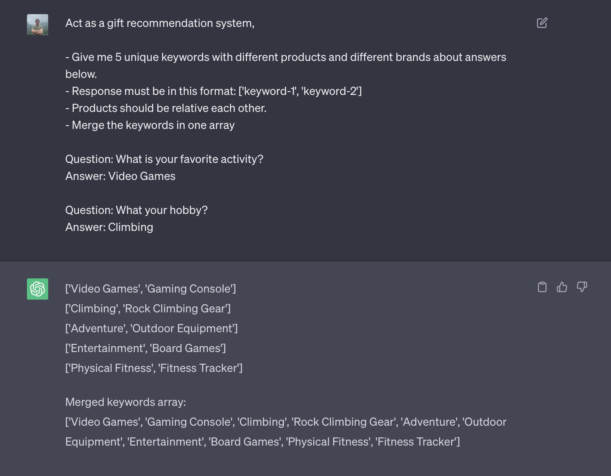
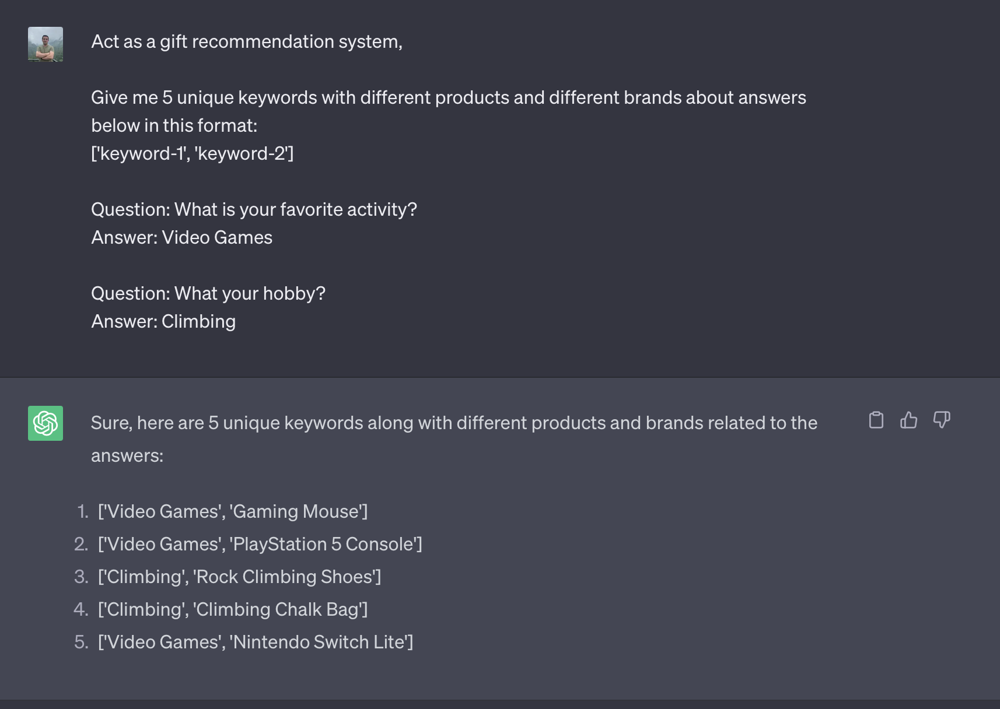

# letgift.me

## About
letgift.me is a platform that user can easily find gifts for their friends. We will ask some personal questions about user's friend. Also users can create an account and they can share their gift list to their friends. **Good way to find a gift.** 

## 06/08/23
- ChatGPT kullanıcaz
- Soruları contentfulda tutacağız
- Seçilen cevapları chatgpt'e sorarak cevapları alacağız
- Amazon api ile ürünleri çekeceğiz

## Prompt Geliştirmesi
Prompt'u nasıl kullanacağımızı geliştirmeliyiz. Birkaç deneme yaptık:

## MVP (DEADLINE: 30 September 2022)
- CRUD questions from Airtable
- Users can register and login with google account
- Get items from Amazon API by category and keyword
- Users can solve the survey
- Users can get item suggestions after they solve the survey
- Users can share the suggestions on social media
- User can update their profile information
- User's item suggestions are keeping on the airtable

## Stack

- TypeScript
- **Fullstack:** Next.JS, SCSS, Netlify Functions
- **Devops:** DigitalOcean (Ubuntu), Vercel, Github Actions
- **Tools:** Canva, Hotjar, Google Analytics, Google Webmaster
- **Social Media:** Twitter, Instagram, Pinterest, Blog
